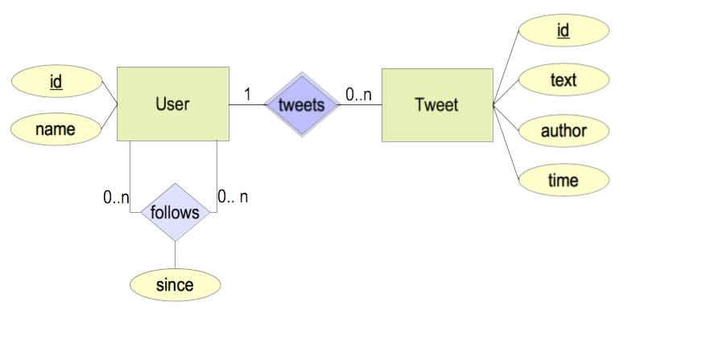

# Intuitter - High level design

## Problem statement
As part of enhancing Intuit's internal services which are available to its employees, build a Twitter like solution for our employees, where employees can tweet and have followers.

High level requirements given are:
* We have 10K employees
* Employees can follow their colleagues, post (or tweet) messages to their followers
* Use corporate LDAP for user Management
* On an average, every employee will send approximately 10 messages a day to their followers
* On the home page we need to show 100 most recent tweets. Optionally you can support pagination.

## Use Cases
Based on the problem statement, following is  list of use cases that I was able to come up with. In reality, an application like Twitter, has far more features than listed here. I'm just listing few important ones that make up minimal viable product (MVP)

1. User should be able to authenticate using an existing LDAP server.
1. User should be able to get feed from all the persons that he/she is following.
1. User should be able to follow another user.
1. User should be able to un-follow a user he/she is currently following.
1. User should be able to post a message.
1. User should be able to upload images/videos onto the server and included its "short" URL in the message.
1. User should be able to mention other users in his/her message.


<<<<<<< HEAD

=======

>>>>>>> branch 'master' of https://github.com/yuga-gandikota/intuitter.git

## Design considerations
Based on the high level requirements and


* Following service returns tweet feed of the current logged in user.
```
GET /api/v1/feed
```

* Following service returns tweet feed for 'employeeId'. Current implementation checks whether employeeId matches the current logged in user or not. But, we can extend it to more complex authorization model. This service takes an optional query string param "page". Its default value is 0. Page size is currently set to '5' (for testing purposes)
```
GET /api/v1/users/{employeeId}/feed[?page={pageNum}]
```

* Following service returns tweets sent by the employee with id 'employeeId'. Current implementation checks whether employeeId matches the current logged in user or not. But, we can extend it to more complex authorization model. ex: allow if current user is a follower of 'employeeId'
```	  
GET /api/v1/users/{employeeId}/tweets[?page={pageNum}]
```

## Assumptions
Following assumptions were made to keep implementation and its testing simple:
* I have set the page size for the tweet feed as 5.
* When user status is not logged in (before first login), for first request to any of the RESTful services application redirects user to login page instead of a typical RESTful response of sending 401 error code.
* After successful login, subsequent unauthorized requests will return 401 error code.
* It is usually a good practice to add some unit testing. Due of time constraints I didn't add any.

## Examples
Few examples. Assuming that you are logged in as 'gauss' with password 'password'.

### Example 1:
Fetch tweet feed for user 'gauss'

Request:
```
GET /api/v1/users/gauss/feed
```

Response:
```
[  
   {  
      "id":15,
      "text":"Tweet message #8 from user euler",
      "author":{  
         "id":"euler",
         "name":"Leonhard Euler"
      },
      "time":1508137200000
   },
   {  
      "id":14,
      "text":"Tweet message #7 from user euler",
      "author":{  
         "id":"euler",
         "name":"Leonhard Euler"
      },
      "time":1508050800000
   },
   {  
      "id":7,
      "text":"Tweet message #7 from user gauss",
      "author":{  
         "id":"gauss",
         "name":"Carl Gauss"
      },
      "time":1508050800000
   },
   {  
      "id":13,
      "text":"Tweet message #6 from user euler",
      "author":{  
         "id":"euler",
         "name":"Leonhard Euler"
      },
      "time":1507964400000
   },
   {  
      "id":6,
      "text":"Tweet message #6 from user gauss",
      "author":{  
         "id":"gauss",
         "name":"Carl Gauss"
      },
      "time":1507964400000
   }
]
```

### Example 2:
Fetch second page of tweet feed for user 'gauss'

Request:
```
GET /api/v1/users/euclid/feed?page=1
```

Response:
```
[  
   {  
      "id":5,
      "text":"Tweet message #5 from user gauss",
      "author":{  
         "id":"gauss",
         "name":"Carl Gauss"
      },
      "time":1507878000000
   },
   {  
      "id":12,
      "text":"Tweet message #5 from user euler",
      "author":{  
         "id":"euler",
         "name":"Leonhard Euler"
      },
      "time":1507878000000
   },
   {  
      "id":4,
      "text":"Tweet message #4 from user gauss",
      "author":{  
         "id":"gauss",
         "name":"Carl Gauss"
      },
      "time":1507791600000
   },
   {  
      "id":11,
      "text":"Tweet message #4 from user euler",
      "author":{  
         "id":"euler",
         "name":"Leonhard Euler"
      },
      "time":1507791600000
   },
   {  
      "id":10,
      "text":"Tweet message #3 from user euler",
      "author":{  
         "id":"euler",
         "name":"Leonhard Euler"
      },
      "time":1507705200000
   }
]
```

## Deployment

This application is built using [Spring Boot](https://spring.io/guides/gs/spring-boot/). Please refer to its documentation about how to run the application.
*NOTE:* If you are unable to reach Forum System's LDAP server, you can skip authentication by setting the following in `application.properties`
```
#disable authentication/authorization check in controllers.
skip.authorization.check=true
```

## Built With

* [Spring Boot](https://spring.io/guides/gs/spring-boot/) - The Spring framework used
* [Maven](https://maven.apache.org/) - Dependency Management
* [Forum Systems](http://www.forumsys.com/tutorials/integration-how-to/ldap/online-ldap-test-server/) - LDAP server used for testing.
* [GitHub][https://github.com/]

## Authors

* **Yuga Gandikota** - *ongoing work :)* - [yuga-gandikota](https://github.com/yuga-gandikota)
