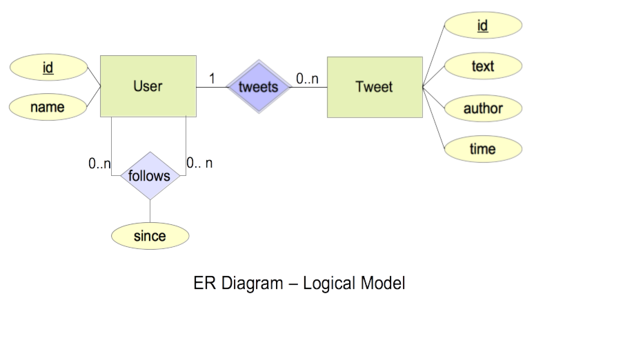

# Intuitter - High level design

## Problem statement
As part of enhancing Intuit's internal services which are available to its employees, build a Twitter like solution for our employees, where employees can tweet and have followers.

High level requirements given are:
* We have 10K employees
* Employees can follow their colleagues, post (or tweet) messages to their followers
* Use corporate LDAP for user Management
* On an average, every employee will send approximately 10 messages a day to their followers
* On the home page we need to show 100 most recent tweets. Optionally you can support pagination.

## Design
In reality, an application like Twitter, has far more features than whats listed here. I'm just listing few important ones that I could come up with. Based on the use cases listed below, I came up with the overall design.

### Use Cases
Based on the problem statement, following is  list of use cases that I came up with.

1. User should be able to authenticate using an existing LDAP server.
1. User should be able to get feed from all other users that he/she is following.
1. User should be able to follow another user.
1. User should be able to un-follow a user he/she is currently following.
1. User should be able to post a message.
1. User should be able to upload images/videos onto the server and include its "short" URL in the message.

###  High level components


#### Security/Admin Layer
This component takes care of making sure that user is authenticated and is authorized to access the resource / service being accessed. We can some additional features in this layer like rate limiting etc. By separating out the authentication and authorization tasks from actual request processing keeps the RESTful controllers layer simple. This layer is responsible for communicating with LDAP server for authentication. We can use framework like Spring Security for this.

Future extension:
* Since most of LDAP servers have some form to roles/groups built in them, we can utilize that feature and build some thing like `automatic following` based on the group that user belongs to. ex: employees automatically follow other employee form their organization unit (or immediate team or next level in the org tree)
* We could also build an implementation of OAuth based on LDAP that can be used across multiple applications.

#### RESTful service
This is the component/layer that takes care of actual processing of the request and returning response. Detailed description of the API will be in the section [Services API](#Services API)

#### Persistence Layer
This layer contains model definition and data access components that help us fetch data, paginate results etc. We could use framework like Spring Data for this.

#### Media Server
Server that hosts media files like images and videos that user want to share.

#### Application Data.
This is the database that holds information about user and tweets. Since we have a relatively small user base and potentially small tweets data, we may be ok with something like a relational database like MariaDB. For a larger data size we could consider NoSQL databases like Cassandra that scale well over period of time. But this requires different data model than we generally use with relational database (denormalized, optimize for read by doing more writes, prevent fetching data from multiple nodes etc)

### data model
Data for this simplified application can be modeled(logical model) using two main entities: `User` and `Tweet`. Refer to the logical data model diagram below for relationships between these entities.





Following diagram shows physical data model:


#### User
Represents employee. Although I have listed only two attributes in the diagram, in reality, there could be more attributes to this entity. When a user A(follower) follows user B(followee), it is represented by using `follows` relationship.

#### Tweet
Represents a message posted by a user. Although, i showed only few attributes for this entity in the diagram, we should be able to extend it to include additional attributes to represent whether is deleted, whether it is a retweet or not etc.


### Services API
Here are some important RESTful services. services that return list of tweets support pagination. For pagination to work effectively, we may have to use a reference point (like last synced time stamp or last seen tweet id or a combination of both). If the tweetId is setup to be sequential, we can probably use it as the reference point.

Client app or the end client remembers the last tweet id that user has seen, and passes it along while making next fetch service call. We use that on the server side and return next 100 tweets with id > lastSeenTweetId.

* Authenticates a user agains LDAP server and creates user entity in the system if does not exist already. Request body has username/password
```
POST /api/v1/authenticate
```

* Fetches details of a user represented by **{employeeId}**
```
GET /api/users/{employeeId}
```

* Following service returns tweet feed of the user represented by **{employeeId}**
```
GET /api/users/{employeeId}/feed[?lastSeenTweet={tweetId}&page={pageNum}]
```

* Gets list of tweet by a user represented by **{employeeId}**
```
GET /api/users/{employeeId}/tweets[?lastSeenTweet={tweetId}&page={pageNum}]
```

* Posts a message.
```
POST /api/users/{employeeId}/tweets
```

* Returns a list of followers of a user represented by **{employeeId}**
```
GET /api/users/{employeeId}/followers
```

* makes the `follows` relationship between **{followerId}** and **{followeeId}**
```
POST /api/users/{followeeId}/followers/{followerId}
```

* removes `follows` relationship between **{followerId}** and **{followeeId}**
```
DELETE /api/users/{followeeId}/followers/{followerId}
```

* Creates short form url for a long url and returns short url that is created.
```
POST /api/shorturl/
```

* returns long url given a short url.
```
GET /api/shorturl/{shorturl}
```
